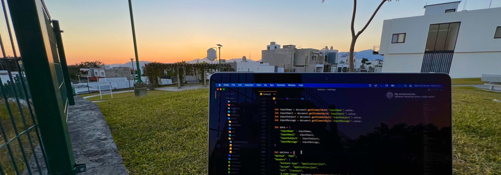

</img>

<h1 align="center">
<b>< I'm  <a href="https://miguelfletes.com" target="blank" style="color:#2d7dfc"> Miguel Fletes </a> </b> />
<h3 align="center">Software Engineer</h3>
</h1>

</img>
<!--
**mfletesg/mfletesg** is a ✨ _special_ ✨ repository because its `README.md` (this file) appears on your GitHub profile.

Here are some ideas to get you started:

- 🔭 I’m currently working on ...
- 🌱 I’m currently learning ...
- 👯 I’m looking to collaborate on ...
- 🤔 I’m looking for help with ...
- 💬 Ask me about ...
- 📫 How to reach me: ...
- 😄 Pronouns: ...
- ⚡ Fun fact: ...
-->

## 🎸 About Me

#### Software Engineer graduated from Instituto Tecnológico de Colima as a Computer Engineer specializing in "High Performance Software", passionate about Open Source technologies.

```json
{
  "city": ["📍Colima, Colima, Mexico", "📍Guadalajara, Jalisco, Mexico"],
  "favoriteLanguage": ["PHP", "Javascript"],
  "hobbies": ["Listen Rock Music 🎸", "Read", "Drink Beer", "Watch the Sunset :)"],
  "webPage": ["https://miguelfletes.com"],
  "linkedIn": ["https://www.linkedin.com/in/miguelfletes/"]
}
```

<br>

## 🤓 Connect with me
<br>

<div align="center">

[](https://www.linkedin.com/in/miguelfletes/)
[](mailto:miguelfg94@outlook.com)
[](https://github.com/mfletesg)


</div>
<br>

## <b> Skills</b>
<br>


- ‍👾 Laravel Framework Experience using Seeders, Controllers, Migrations, Eloquent ORM, Blade, Middleware’s, Models, Composer and REST FULL Service.

- 🛒 Experience to perform integrations and components with ReactJS, Store Theme and Master Data v2 in VTEX.IO platform.

- 🎨 Knowledge in Integration Development with Salesforce APEX.

- 📱 Experience in mobile app development with the IONIC Framework, using Angular with the use of libraries such as Facebook API, Twitter, Google Cloud, Maps and Firebase.
  
- ‍💻 Knowledge for creating a REST API using Javascript and Typescript (Express.Js, NestJs, Loopback 4).

- 📄 Knowledge in other technologies such as Java, Python, HTML, Git, XML, CSS, CSV, Bootstrap, Babel, Semantic UI, JQuery, JSON.
  
- 📊 Experience in managing Relational Databases such as MySQL, SQL Server, and PostgreSQL.

- 🐧Proficiency in Linux distributions for software development with terminal (Ubuntu).

- <h3> Languages </h3>
  
  
  
  
  
  
  

- <h3> Frameworks & Libraries </h3>
  
  
  
  
  
  
  
  
  
  
  

- <h3> Ecommerce </h3>
  
  
  
  


- <h3> Database </h3>
  
  
  
  


- <h3> Operative Systems for developing</h3>
  
  
  


- <h3> Designing Tools</h3>
  
  
  
  
    


- <h3>Tools</h3>
  
  
  
  
  
  
  
  
  
  
  
  
  