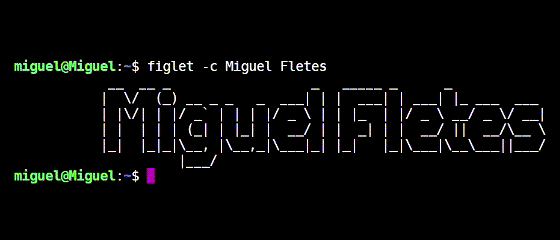

</img>

<h1 align="center">
<b>< I'm  <a href="https://miguelfletes.com" target="blank" style="color:#2d7dfc"> Miguel Fletes </a> </b> />
<h3 align="center">Software Engineer</h3>
</h1>


<div align="center">
</img>
</div>

<!--
**mfletesg/mfletesg** is a ✨ _special_ ✨ repository because its `README.md` (this file) appears on your GitHub profile.

Here are some ideas to get you started:

- 🔭 I’m currently working on ...
- 🌱 I’m currently learning ...
- 👯 I’m looking to collaborate on ...
- 🤔 I’m looking for help with ...
- 💬 Ask me about ...
- 📫 How to reach me: ...
- 😄 Pronouns: ...
- ⚡ Fun fact: ...
-->

## 🎸 About Me

#### Software Engineer graduated from Instituto Tecnológico de Colima as a Computer Engineer specializing in "High Performance Software", passionate about Open Source technologies.


```json
{
  "city": ["📍 Colima, Colima, México", "📍 Guadalajara, Jalisco, México"],
  "favoriteLanguage": ["PHP", "Javascript"],
  "hobbies": ["Listen Rock Music", "Read", "Drink Beer", "Watch the Sunset :)"],
  "webPage": "https://miguelfletes.com",
  "linkedIn": "https://www.linkedin.com/in/miguelfletes/",
  "song": "Everlong - Foo Fighters ❤️"
}
```

<br>

## 🤓 Connect with me

<br>

<div align="center">

  [](https://www.linkedin.com/in/miguelfletes/)
  [](mailto:miguelfg94@outlook.com)
  <br><br/>
  <div align="center">
    
  </div>
  <br>
</div>
<br>

## <b> Skills</b>
<br>

- ‍👾 Laravel Framework Experience using Seeders, Controllers, Migrations, Eloquent ORM, Blade, Middleware’s, Models, Composer and REST FULL Service.

- 🛒 Experience to perform integrations and components with ReactJS, Store Theme and Master Data v2 in VTEX.IO platform.

- 🎨 Knowledge in Integration Development with Salesforce APEX.

- 📱 Experience in mobile app development with the IONIC Framework, using Angular with the use of libraries such as Facebook API, Twitter, Google Cloud, Maps and Firebase.
  
- ‍💻 Knowledge for creating a REST API using Javascript and Typescript (Express.Js, NestJs, Loopback 4).

- 📄 Knowledge in other technologies such as Java, Python, HTML, Git, XML, CSS, CSV, Bootstrap, Babel, Semantic UI, JQuery, JSON.
  
- 📊 Experience in managing Relational Databases such as MySQL, SQL Server, and PostgreSQL.

- 🐧Proficiency in Linux distributions for software development with terminal (Ubuntu).


- <h3> Languages </h3>
  
  [](https://www.php.net)
  [](https://developer.mozilla.org/es/docs/Web/JavaScript)
  [](https://www.typescriptlang.org)
  [](https://dev.w3.org/html5/spec-LC/)
  [](https://developer.mozilla.org/es/docs/Web/CSS)
  [](https://www.json.org/json-en.html)
  [](https://developer.mozilla.org/es/docs/Web/XML/XML_introduction)


- <h3> Frameworks & Libraries </h3>
  
  [](https://react.dev/)
  [](https://laravel.com)
  [](https://angular.dev)
  [](https://ionicframework.com)
  [](https://expressjs.com)
  [](https://loopback.io/doc/es/lb4/)
  [](https://nestjs.com)
  [](https://spring.io)
  [](https://vuejs.org)
  [](https://semantic-ui.com)
  [](https://getbootstrap.com/)


- <h3> Ecommerce </h3>
  
  [](https://vtex.com/us-en/vtex-io/)
  [](https://woocommerce.com)
  [](https://www.shopify.com)
  [](https://www.salesforce.com/eu/?ir=1)


- <h3> Database </h3>
  
  [](https://www.mysql.com/)
  [](https://www.oracle.com/database/)
  [](https://www.postgresql.org/)
  [](https://www.microsoft.com/en-us/sql-server/)


- <h3> Operative Systems for developing</h3>
  
  [](https://www.apple.com/mx/macos/)
  [](https://www.linux.org/)
  [](https://www.microsoft.com/software-download/windows11)
  


- <h3> Designing Tools</h3>
  
  [](https://inkscape.org/)
  [](https://www.adobe.com/mx/products/illustrator.html)
  [](https://www.figma.com/)
  [](https://www.adobe.com/mx/products/photoshop.html)
  [](https://helpx.adobe.com/xd/get-started.html)


- <h3>Tools</h3>
  
  [](https://git-scm.com/)
  [](https://github.com/)
  [](https://code.visualstudio.com/)
  [](https://www.sublimetext.com/)
  [](https://www.jetbrains.com/phpstorm/)
  [](https://ubuntu.com/download)
  [](https://www.vim.org/)
  [](https://www.postman.com/)
  [](https://www.soapui.org/)
  [](https://hyper.is/)
  [](https://insomnia.rest/download)
  [](https://swagger.io/)
  [](https://www.nano-editor.org/)


- <h3>Cybersecurity tools</h3>
  
  [](https://www.kali.org/)
  [](https://github.com/vk496/linset)
  [](https://www.aircrack-ng.org/)
  [](https://github.com/t6x/reaver-wps-fork-t6x)
  [](https://blog.elhacker.net/2015/01/goyscript-wep-wpa-wps-dic-wireless-wifi.html)
  [](https://www.wireshark.org/download.html)
  [](https://portswigger.net/burp)
  [](https://www.kali.org/tools/hydra/)

<br/>
<br/>
<br/>

<div align="center">
  <a href="https://youtu.be/UWgEPLkW2gE?si=EODfGmmGgfGz5grZ">
    
  </a>
</div>

<div align="center">
<br/>
    <p><b>Make with 🎸, 🍺, ☕ by Miguel Fletes</b></p>
</div>